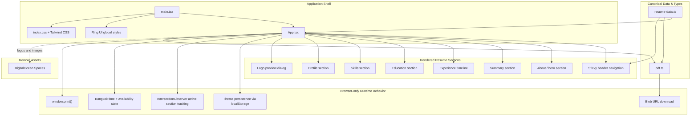

[](https://github.com/prettier/prettier)

# Nawaphon Isarathanachaikul — Résumé Portfolio (React Version)

A public React single-page résumé built with Ring UI and Tailwind CSS. It includes responsive section navigation, remembered light and dark themes, browser-print styling, accessible image zoom previews, and a user-triggered browser-generated PDF download.

## Requirements

- Node.js 22 or newer
- npm 10 or newer

## Install and run locally

```bash
npm ci
npm run dev
```

Open `http://localhost:5173/`. The development server reloads when source files change.

## Architecture & Component Graph

The project follows a compact React + Vite architecture with one application shell, typed canonical résumé data, browser-only UI state, and a client-side PDF generator.



- **Application Shell:** `src/main.tsx` mounts the React app and imports the shared Ring UI and Tailwind-driven global styles.
- **Single Page UI:** `src/App.tsx` renders the full résumé page, including the sticky navigation, hero content, experience timeline, education, skills, profile cards, print action, and zoom dialog.
- **Typed Canonical Data:** `src/resume-data.ts` defines the résumé contracts, section registry, and publishable résumé content used throughout the app.
- **Client-side PDF Generator:** `src/pdf.ts` converts the canonical résumé data into a browser-generated PDF and downloads it with a blob URL.
- **Remote Assets:** company, university, and link logos are loaded from the public DigitalOcean Spaces origin.

## Computer Science Concepts & Prerequisites

To understand and maintain the implementation, familiarity with the following concepts is helpful:

### 1. Component-driven UI composition

- **Single-page composition:** `App.tsx` renders the whole résumé as one composed React tree while keeping the canonical data separate in `resume-data.ts`.
- **Typed UI contracts:** the résumé data is modeled with TypeScript interfaces so content changes remain structurally consistent across sections.

### 2. Browser state synchronization

- **Persistent theme preference:** the active light/dark theme is synchronized with `localStorage` and reflected through `data-theme` on the root document element (`src/App.tsx`).
- **Time-derived UI state:** Bangkok-local time drives the availability badge and live timestamp display in the hero section (`src/App.tsx`).

### 3. Viewport observation and navigation state

- **IntersectionObserver section tracking:** visible sections are observed in the browser so the sticky navigation can highlight the most active section as the user scrolls (`src/App.tsx`).
- **Anchor-based document navigation:** section links use hash fragments and `scroll-behavior: smooth` to provide in-page navigation (`src/App.tsx`, `src/index.css`).

### 4. Accessibility and focus management

- **Modal keyboard support:** the zoom dialog moves focus to its close button when opened, supports Escape to dismiss, cycles focus within the dialog, and restores focus to the previous trigger when closed (`src/App.tsx`).
- **Accessible control naming:** theme, logo-preview, and close controls expose explicit accessible labels and pressed state where appropriate (`src/App.tsx`).

### 5. Client-side document generation

- **Text normalization for PDF output:** the PDF builder normalizes punctuation and strips unsupported characters before embedding text into a raw PDF content stream (`src/pdf.ts`).
- **Byte-accurate PDF serialization:** stream lengths and cross-reference offsets are measured in encoded byte lengths rather than UTF-16 code units to keep generated PDFs structurally valid (`src/pdf.ts`).
- **Line wrapping and pagination:** the PDF generator wraps long text and derives page capacity from page geometry constants so multi-page output remains readable (`src/pdf.ts`).

## Edit résumé content

All publishable résumé facts and shared section metadata live in `src/resume-data.ts`. Update that data source rather than duplicating content in `src/App.tsx`.

The phone value must remain `Available on request`. Do not add a phone number or a `tel:` link anywhere in the project.

## Static assets

All project-owned images are served from the DigitalOcean Space origin `https://resume-images.ohm-mho.space`.

The React app currently uses remote assets for:

- `/company-logos/...`
- `/link-logos/...`
- `/university-logos/...`

If an image request fails, the application currently has no custom local fallback asset pipeline.

## On-demand résumé PDF

Activating the Download PDF control generates the résumé directly in the browser from the canonical typed résumé data in `src/resume-data.ts`.

The current React implementation does not load an external PDF runtime. Instead, `src/pdf.ts`:

- normalizes résumé text for PDF-safe output,
- wraps long content into printable lines,
- paginates based on page geometry,
- serializes a minimal PDF document,
- downloads the file through a temporary blob URL.

The generated filename is derived from the résumé name and normalized to a safe slug before download.

## Formatting and tests

```bash
npm run format:check
npm run lint
npm run build
```

Prettier verifies formatting, ESLint checks the TypeScript/React source, and the production build validates TypeScript compilation plus the Vite bundle.

This repository does not currently define an `npm test` script.

## Production build

```bash
npm run build
```

The production command compiles the React application and emits a static Vite build in:

```text
dist/
```

The output is host-neutral and requires no backend, runtime API, or server-side rendering.

## Useful scripts

| Command                | Purpose                                   |
| ---------------------- | ----------------------------------------- |
| `npm run dev`          | Run the Vite development server.          |
| `npm run build`        | Produce the static production build.      |
| `npm run lint`         | Run ESLint across the repository.         |
| `npm run preview`      | Preview the production build locally.     |
| `npm run format:check` | Verify formatting without changing files. |
