[](https://github.com/prettier/prettier)

# Nawaphon Isarathanachaikul — Résumé Portfolio (React Version)

A public React single-page résumé built with Ring UI and Tailwind CSS. It includes responsive section navigation, remembered light and dark themes, Bangkok-time availability signaling, dynamic favicon switching, browser-print styling, accessible image zoom previews, and a resilient hosted PDF download flow with pre-flight availability verification and confirmation.

## Requirements

- Node.js 22 or newer
- npm 10 or newer

## Install and run locally

```bash
npm ci
npm run dev
```

Open `http://localhost:5173/`. The development server reloads when source files change.

## Architecture & Component Graph

The project follows a compact React + Vite architecture with one application shell, typed canonical résumé data, browser-only UI state, remote asset integration, and a hosted PDF download flow.

```mermaid
graph TD
    subgraph Entry["Application Shell"]
        MAIN["main.tsx"] --> APP["App.tsx"]
        MAIN --> RING["Ring UI global styles"]
        MAIN --> TAILWIND["index.css + Tailwind CSS"]
    end

    subgraph PageLayer["Rendered Resume Sections"]
        APP --> NAV["Sticky header navigation"]
        APP --> HERO["About / hero section"]
        APP --> SUMMARY["Summary section"]
        APP --> EXPERIENCE["Experience timeline"]
        APP --> EDUCATION["Education section"]
        APP --> SKILLS["Skills section"]
        APP --> PROFILE["Profile section"]
        APP --> ZOOM["Logo preview dialog"]
        APP --> PDF_DIALOG["PDF confirmation dialog"]
    end

    subgraph DataLayer["Canonical Data & Types"]
        DATA["resume-data.ts"] --> APP
        DATA --> NAV
    end

    subgraph Runtime["Browser-only Runtime Behavior"]
        APP --> THEME["Theme persistence via localStorage"]
        APP --> OBSERVER["IntersectionObserver active section tracking"]
        APP --> STATUS["status.ts availability schedule"]
        STATUS --> FAVICON["Dynamic favicon synchronization"]
        APP --> PDF["pdf.ts hosted download flow"]
        PDF --> HEAD["HEAD availability check"]
        PDF --> STREAM["XHR download progress"]
        APP --> PRINT["window.print()"]
    end

    subgraph Assets["Remote Assets"]
        APP -.->|logos, favicons, hosted PDF| DO["DigitalOcean Spaces"]
    end
```



- **Application Shell:** `src/main.tsx` mounts the React app and imports the shared Ring UI and Tailwind-driven global styles.
- **Single Page UI:** `src/App.tsx` renders the full résumé page, including navigation, theme controls, hosted PDF controls, confirmation dialog, zoom dialog, and all résumé sections.
- **Typed Canonical Data:** `src/resume-data.ts` defines the résumé contracts, section registry, and publishable résumé content used throughout the app.
- **Availability & Favicon Logic:** `src/status.ts` resolves Bangkok-time availability states and maps them to dynamic favicon URLs and badge presentation.
- **Hosted PDF Download Flow:** `src/pdf.ts` checks hosted PDF availability with a `HEAD` request, streams the file with progress reporting, and triggers browser download through a blob URL.

## Computer Science Concepts & Prerequisites

To understand and maintain the implementation, familiarity with the following concepts is helpful:

### 1. Component-driven UI composition

- **Single-page composition:** `App.tsx` renders the full résumé as one React tree while keeping content and UI rules outside the JSX where practical.
- **Typed UI contracts:** résumé content is modeled with TypeScript interfaces so content edits remain structurally consistent across sections.

### 2. Timezone-based state machines

- **Bangkok availability scheduling:** `src/status.ts` derives availability from weekday and time boundaries in the `Asia/Bangkok` timezone, distinguishing `available`, `limited`, and `unavailable` states.
- **Time-derived presentation:** the live clock, availability badge, and favicon all react to the same current instant so the UI remains consistent.

### 3. Browser state synchronization

- **Persistent theme preference:** the active light/dark theme is synchronized with `localStorage` and reflected through `data-theme` on the document root (`src/App.tsx`).
- **Dynamic favicon switching:** the active availability state is mapped to a remote favicon variant and synchronized with the document head (`src/status.ts`, `src/App.tsx`).

### 4. Viewport observation and navigation state

- **IntersectionObserver section tracking:** visible sections are observed in the browser so the sticky navigation can highlight the most active section as the user scrolls (`src/App.tsx`).
- **Anchor-based navigation:** section links use hash fragments and smooth scrolling for in-page navigation (`src/App.tsx`, `src/index.css`).

### 5. Accessibility and focus management

- **Modal keyboard support:** both the zoom dialog and PDF confirmation dialog move focus into the dialog, support Escape dismissal, cycle focus within the modal, and restore focus to the prior trigger when closed (`src/App.tsx`).
- **Accessible controls:** theme, download, zoom, and close controls expose explicit labels, state, and busy feedback (`src/App.tsx`).

### 6. Client-side file transfer orchestration

- **Pre-flight verification:** the hosted résumé PDF is checked with a `HEAD` request before download so the UI can signal possible unavailability (`src/pdf.ts`).
- **Progress-aware download streaming:** the download flow uses `XMLHttpRequest` progress events to expose determinate percentages when the remote server reports total size (`src/pdf.ts`).
- **Blob URL handoff:** downloaded binary data is converted into a temporary object URL and activated with a hidden anchor so the browser handles the file save UX (`src/pdf.ts`).

## Edit résumé content

All publishable résumé facts and shared section metadata live in `src/resume-data.ts`. Update that data source rather than duplicating content in `src/App.tsx`.

The phone value must remain `Available on request`. Do not add a phone number or a `tel:` link anywhere in the project.

## Static assets

All project-owned images and hosted downloads are served from the DigitalOcean Space origin `https://resume-images.ohm-mho.space`.

The React app currently uses remote assets for:

- `/company-logos/...`
- `/link-logos/...`
- `/university-logos/...`
- `/favicons/available/favicon.svg`
- `/favicons/limited/favicon.svg`
- `/favicons/unavailable/favicon.svg`
- `/downloadable-resume/Nawaphon_Isarathanachaikul.pdf`

If a remote asset request fails, the application currently has no custom local fallback asset pipeline. Image and favicon assets stay remote-only, so the browser may continue showing the last reachable favicon or omit that asset entirely until the remote request succeeds again.

## On-demand résumé PDF

Activating the Download PDF control downloads the hosted résumé PDF asset from:

- `https://resume-images.ohm-mho.space/downloadable-resume/Nawaphon_Isarathanachaikul.pdf`

The React implementation first performs a `HEAD` request to detect whether the hosted file appears available.

- If the file looks available, the app starts streaming the download immediately.
- If the file looks unavailable, the app opens an accessible confirmation dialog so the user can decide whether to continue anyway.
- If the user chooses to continue after a failed availability probe, the app attempts the hosted download directly and future retries stay in direct-download mode unless a later probe result changes.
- While the download is in progress, the control exposes busy and percentage-based progress feedback when possible.
- If the hosted file request itself fails, the browser download does not start and there is no local PDF fallback.

The downloaded filename is fixed as:

- `nawaphon-isarathanachaikul-resume-profile.pdf`

## Formatting and tests

```bash
npm run format:check
npm run lint
npm run build
```

Prettier verifies formatting, ESLint checks the TypeScript/React source, and the production build validates TypeScript compilation plus the Vite bundle.

This repository does not currently define an `npm test` script.

## Production build

```bash
npm run build
```

The production command compiles the React application and emits a static Vite build in:

```text
dist/
```

The output is host-neutral and requires no backend, runtime API, or server-side rendering.

## Useful scripts

| Command                | Purpose                                   |
| ---------------------- | ----------------------------------------- |
| `npm run dev`          | Run the Vite development server.          |
| `npm run build`        | Produce the static production build.      |
| `npm run lint`         | Run ESLint across the repository.         |
| `npm run preview`      | Preview the production build locally.     |
| `npm run format:check` | Verify formatting without changing files. |
